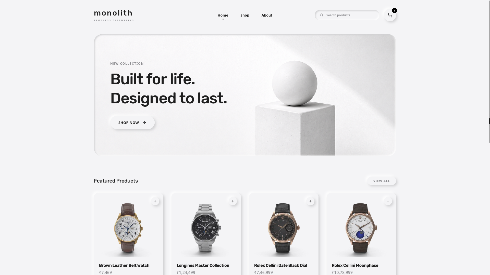
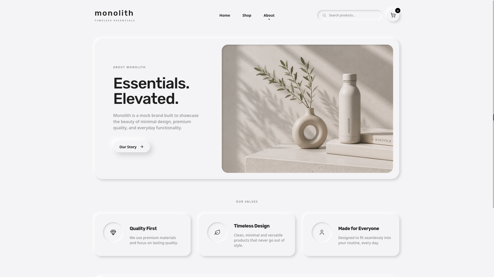

# Monolith

### Timeless Essentials. Elevated.

_A modern exploration of Neumorphic design patterns in eCommerce._

 

 

---

## 🎨 The Philosophy: My Take on Neumorphism

**Monolith** is a conceptual eCommerce storefront born from a desire to reimagine **Neumorphism** (Soft UI). Often criticized for accessibility issues or feeling overly plastic, this project attempts to ground the aesthetic into something highly usable, premium, and tactile.

By relying on a tightly controlled monochromatic palette (`#F4F4F6` base), carefully calibrated lighting angles, and subtle interactive states, the UI feels less like a website and more like a physical, machined object.

### Key Design Tenets

- **Physicality**: Elements extrude from or indent into the background, creating a unified material surface.
- **Restraint**: Zero harsh borders. Depth is achieved exclusively through highlight and shadow manipulation.
- **Fluidity**: Transitions are butter-smooth, using custom spring-like bezier curves for that satisfying "snap" when interacting with elements.
- **Micro-Interactions**: From the custom inset scrollbars to the floating "Add to Cart" pills, every interaction is designed to feel delightfully tactile.

 

  

 

## 🛠️ The Architecture

While visually soft, the underlying architecture is robust and dynamic:

- **Live Data Pipeline**: The shop is fully integrated with the [DummyJSON API](https://dummyjson.com/), featuring dynamic category fetching, real-time live search routing, and seamless infinite-scroll pagination.
- **State Management**: Zero complex boilerplate. A lightweight, bespoke Context API manages the global shopping cart state across the application.
- **Responsive Mastery**: The layout fluidly adapts from a multi-column desktop grid to a highly optimized mobile experience, including an app-like bottom navigation pill for touch devices.

---

  <i>"Design is not just what it looks like and feels like. Design is how it works."</i>

